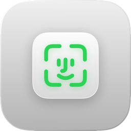
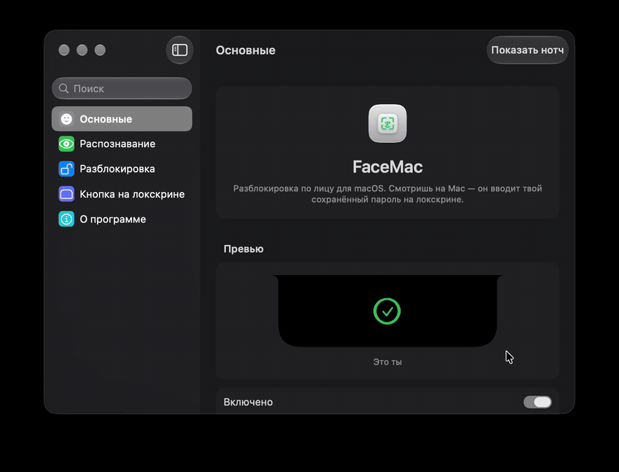

<div align="center">



# FaceMac

**看着 Mac，它就解锁了。**

适用于 macOS 的开源面容解锁 —— 免费、私密，住在灵动岛里。
没有订阅。没有云端。没有账号。你的面容永不离开这台机器。

[English](README.md) · [Русский](README.ru.md) · **中文**

</div>

---

## 核心

合上盖子，打开盖子，又得输密码。一天二十次。图什么？

**FaceMac 通过内置摄像头认出你，并在你自己的锁屏上输入你自己保存的密码。**
灵动岛亮起、扫描、画出对勾 —— 你还没坐稳就已经进去了。大约一秒，然后摄像头关闭。

这就是 MacGaze 做的事，只不过开源、免费，而且可以随意改造。

## 为什么换过来

- **永久免费。** 一个二进制文件，GPL-3.0，没有试用、没有许可证密钥、没有“家庭套餐”。
- **天生私密。** 画面只在**你的 Mac 上**变成度量数据。帧从不写入磁盘，
  面容特征和密码永不离开本机。
- **灵动岛就是界面。** 真正的覆盖层：从灵动岛长出来，扫描时脉冲绿色面容图标，
  成功时收拢成对勾。
- **知道那不是你。** 陌生人会在约 0.4 秒内被红色抖动拒绝，而不是等满 5 秒。
- **摄像头会关闭。** 5 秒没有匹配就停止；绿灯只在真正识别时亮起。
- **端侧机器学习。** SFace（Apache-2.0）经 CoreML 运行，128 维向量，录入时按你的脸校准。

## 长什么样

### 灵动岛


扫描 → 匹配 → 拒绝，全都在灵动岛里，没有窗口、没有弹窗。

### 设置



## 功能

| | |
|---|---|
| 灵动岛覆盖层 | 真正的 `NSPanel`，浮于一切之上，包括锁屏（SkyLight） |
| Face ID 风格动画 | 绿色扫描 → 形变为 Lottie 对勾 |
| 引导录入 | 五个提示 —— 正视、左转、右转、歪头 —— 带实时圆环 |
| 即时拒绝 | “明显不是你”立刻捕获，红色抖动 |
| 校准 | 匹配阈值按你的脸、摄像头与光线自动调整 |
| 防漂移 | 最近参考**与**质心都要一致，且需连续 N 帧 |
| 画质过滤 | 过小或过度侧转的脸被忽略，而不是靠猜 |
| 重试按钮 | 锁屏上的玻璃按钮，可再试一次 |
| 多语言 | English, Русский, 中文 —— 跟随系统或手动切换 |
| 隐私 | 全部本地；识别结束摄像头即关闭 |

## 工作原理

```
摄像头帧
  → Vision 人脸检测 + 5 个关键点
  → 相似变换对齐到 112×112（ArcFace 画框）          (FaceAligner)
  → SFace CoreML 向量，128 维，L2 归一化            (MLFaceEmbedder)
  → 与录入样本的余弦相似度                          (FaceMatcher)
  → 最近样本 + 质心 + 连续 3 帧都需一致
  → 用 CGEvent 输入 Keychain 里的密码               (KeyboardInjector)
```

运行时没有 Python，没有模型服务器，识别过程不发起任何网络请求。

## 安装

### 从 Release 安装（最简单）

1. 在 **Releases** 下载 `FaceMac-x.y.z.dmg`。
2. 打开后把 **FaceMac** 拖进 **Applications**。
3. 仅首次启动：右键应用 → **打开**。当前版本尚未公证，macOS 会询问一次，之后即可正常使用。

### 从源码构建

```sh
git clone https://github.com/<you>/FaceMac.git
cd FaceMac

scripts/fetch-model.sh   # 构建 SFace 的 CoreML 模型（仅一次，需 Python 3.12+）
scripts/install.sh       # 构建、安装到 ~/Applications 并启动
```

### 然后在菜单栏图标里

1. **设置已保存的密码…** —— 你的 macOS 登录密码，存入钥匙串。
2. **授予辅助功能权限…** —— 以便在锁屏输入该密码。
3. **录入面容…** —— 五个快速头部姿势。
4. 保持 **已启用**，然后锁定 Mac（`⌃⌘Q`）。

菜单里的 **预览灵动岛动画** 可以在不解锁的情况下看完整效果。

## 系统要求

- Apple 芯片 Mac，macOS 14 或更高
- 内置摄像头（不使用连续互通相机 —— 被锁在外面时 iPhone 不会在旁边）

权限与**稳定的代码签名**绑定。FaceMac 使用 `Apple Development` 身份签名，
因此 macOS 在重新构建后仍保留摄像头与辅助功能授权；ad-hoc 签名会让你每次都重新授权。

## 关于安全，说实话

FaceMac 提供的是**便利**，不是安全升级。

- 内置摄像头没有红外与深度传感器。打印照片进不来，但用手机屏幕播放你的视频可能
  骗过它。Apple 靠硬件解决，网络摄像头做不到。
- 它把 macOS 登录密码存在钥匙串里，因为这就是替你输入的方式。它不会离开本机 ——
  但它的确**在**本机上。
- 它不会把你锁在外面：失败或退出时，你照常手动登录。
- 屏幕解锁状态下不会运行识别；没有扫描时摄像头是关闭的。

## 从源码构建

```sh
swift build          # 核心库 + CLI
swift test           # 22 个单元测试，含 CoreML 与 ONNX 的一致性测试
xcodegen generate    # 生成 FaceMac.xcodeproj
```

结构：

```
Sources/
  FaceMacCore/     采集、Vision 对齐、SFace 嵌入、匹配、
                   钥匙串、锁屏监听、CGEvent 输入、协调器
  FaceMacApp/      菜单栏应用、灵动岛覆盖层、设置窗口
  FaceMacDemo/     无界面 CLI（info / enroll / match）
Tools/Conversion/  SFace ONNX → CoreML 转换 + 黄金向量
Tools/Icon/        应用图标生成器
scripts/           fetch-model.sh, install.sh, make-icon.sh
```

## 路线图

- [x] 端侧 SFace 向量 + 按脸校准
- [x] 覆盖锁屏的灵动岛 + Face ID 风格动画
- [x] 引导录入、即时拒绝、锁屏重试按钮
- [ ] 活体检测（眨眼 / 微动作）
- [ ] 一台 Mac 支持多张脸
- [ ] 通过特权助手支持登录前（FileVault）
- [ ] Homebrew cask

## 致谢

- **SFace** —— OpenCV Zoo，Apache-2.0。识别模型。
- **Atoll** —— GPL-3.0。灵动岛覆盖层方案。
- **SkyLightWindow** —— MIT。锁屏之上的窗口。
- **Lottie** —— Apache-2.0。

与 Apple 无关联。Face ID 是 Apple Inc. 的商标。

## 许可证

GPL-3.0 —— 见 [LICENSE](LICENSE)。随便用、随便 fork、随便发布，只要保持开源。
